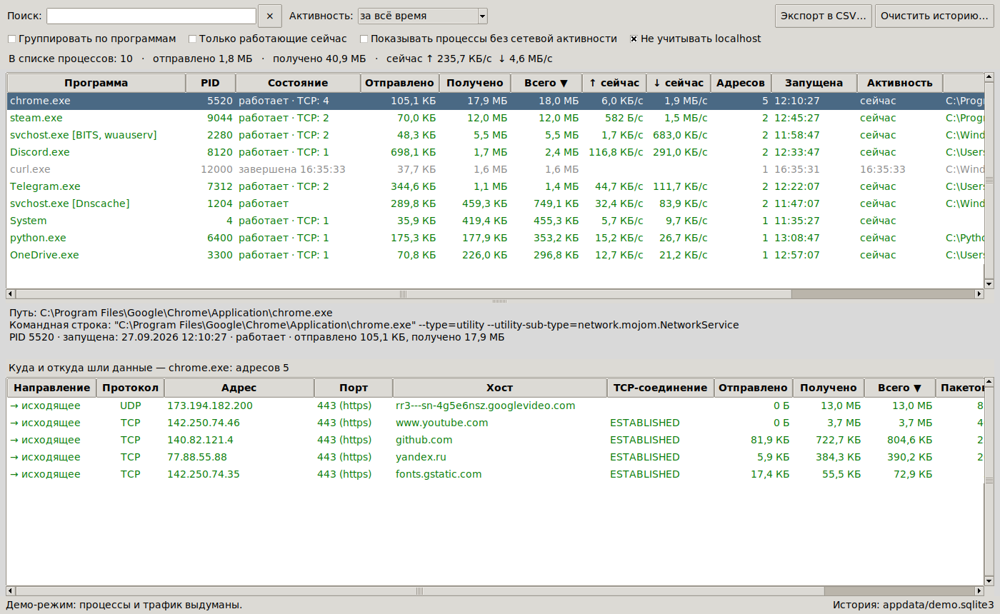

# Сетевая активность программ (Windows)

Программа на Python показывает, какие программы в Windows работали и работают
с сетью, сколько байт каждая отправила и получила и с какими адресами
(и хостами) шёл обмен. История сохраняется, так что видны и программы,
которые уже закрылись.

Сторонние библиотеки не нужны: только стандартный Python (ctypes, tkinter, sqlite3).



## Что видно

**Верхняя таблица — программы (процессы):**
- имя, PID, для `svchost.exe` — какие службы в нём работают (`svchost.exe [BITS, wuauserv]`);
- работает или завершена (и когда), когда запущена;
- сколько байт отправлено и получено за всё время наблюдения;
- текущая скорость ↑/↓;
- сколько разных адресов было, число открытых TCP-соединений;
- путь к exe; в панели ниже — командная строка.

**Нижняя таблица — куда и откуда шли данные у выбранной программы:**
- направление: `→ исходящее` (программа подключалась сама) или `← входящее`
  (к ней подключались на её порт);
- протокол (TCP/UDP), IP-адрес, порт (с подсказкой: `443 (https)`, `53 (dns)`…);
- **хост**: имя, которое программа сама запрашивала у DNS (например,
  `api.github.com`), а если его нет — имя из обратного DNS;
- состояние TCP-соединения, если оно открыто сейчас;
- байты в обе стороны, число пакетов, когда был первый и последний обмен.

Ещё есть:
- **группировка по программам**: все запуски `chrome.exe` в одну строку;
- фильтры «только работающие», «активность за час / сутки / 7 дней…»;
- поиск по имени, пути, PID, службе, **а также по адресу и хосту**: например,
  по запросу `google` видно, какие программы обращались к Google;
- «Не учитывать localhost»: обмен внутри компьютера не смешивается с интернетом;
- экспорт в CSV (открывается в Excel), контекстное меню (копировать, открыть
  папку программы, «кому принадлежит адрес» на ipinfo.io).

## Требования

- Windows 10 или 11 (Windows 8.1 тоже должна подойти);
- Python 3.8+ с сайта [python.org](https://www.python.org/downloads/windows/)
  (tkinter входит в установщик по умолчанию);
- **права администратора**: без них Windows не отдаёт события сетевого стека.
  Программа сама запросит их через окно UAC.

## Запуск

```bat
cd netmon
python main.py
```

Или двойной щелчок по `NetMon.bat` (без чёрного окна консоли).

Другие режимы:

```bat
python main.py --demo              :: демо с выдуманными данными (без прав администратора)
python main.py --console           :: живая таблица в консоли (запускать в консоли администратора)
python main.py --report            :: отчёт по сохранённой истории
python main.py --report --days 7   :: отчёт за последние 7 дней
python main.py --help              :: все параметры
```

## Где хранится история

`%LOCALAPPDATA%\NetActivityMonitor\`:
- `history.sqlite3` — история (по умолчанию хранится 90 дней, параметр `--keep-days`);
- `netmon.log` — журнал (пригодится, если что-то не работает);
- `settings.json` — состояние галочек и размер окна.

Кнопка «Очистить историю…» удаляет всё и начинает счёт с нуля.
Параметр `--no-history` отключает сохранение на диск.

## Как это работает

Данные берутся из **Event Tracing for Windows (ETW)**, из того же источника,
что и у «Монитора ресурсов» Windows:

| Провайдер ETW | Что даёт |
|---|---|
| `Microsoft-Windows-Kernel-Network` | каждая отправка и приём TCP/UDP (IPv4 и IPv6): PID владельца сокета, адреса, порты, число байт |
| `Microsoft-Windows-Kernel-Process` | запуск и завершение процессов: имена даже у программ, которые прожили долю секунды |
| `Microsoft-Windows-DNS-Client` | какие имена процесс разрешал и в какие IP: отсюда колонка «Хост» |

Дополнительно раз в 2 секунды программа читает список процессов и таблицу TCP-соединений
(`GetExtendedTcpTable`). Из неё видны открытые, но молчащие соединения и слушающие порты,
по которым определяется направление «входящее/исходящее».

Файлы:

| Файл | Назначение |
|---|---|
| `main.py` | точка входа, параметры командной строки, запрос прав администратора |
| `etw.py` | сеанс ETW через ctypes, разбор событий (раскладка полей берётся из манифеста через TDH) |
| `winapi.py` | процессы, службы, TCP-таблица, командная строка процессов |
| `model.py` | учёт: процессы → адресаты → байты, привязка DNS-имён |
| `storage.py` | история в SQLite |
| `monitor.py` | рабочий поток: опрос системы, обратный DNS, сохранение |
| `gui.py` / `console.py` | окно (tkinter) и текстовый режим / отчёт |
| `demo.py` | демо-режим |

## Что нужно знать о цифрах

- Считается **полезная нагрузка** TCP/UDP, то есть данные программы без заголовков IP/TCP.
  Поэтому цифры немного меньше, чем показывает счётчик сетевого адаптера.
- Пакеты, которые не принадлежат ни одному сокету (ICMP/ping, ARP, трафик драйверов VPN
  и виртуальных машин), здесь не видны.
- Трафик служб Windows идёт от `svchost.exe`; в скобках видно, какие именно службы там работают.
- `System` (PID 4) — трафик ядра: общие папки (SMB), HTTP.sys и т.п.
- Если браузер использует собственный «DNS поверх HTTPS», его запросы не проходят через
  DNS-клиент Windows. Тогда имя хоста берётся из обратного DNS, и это бывает имя
  CDN-сервера, а не сайта.
- При огромном потоке событий (гигабитная загрузка) часть событий может потеряться:
  счётчик «потеряно» есть в строке состояния.
- Статистика собирается только пока программа запущена. Что было до запуска, узнать нельзя.

## Если что-то не работает

- «Сбор статистики не работает: отказано в доступе» — запустите от имени администратора.
- Байты не растут, хотя есть трафик: попробуйте `python main.py --no-etw-filter` и пришлите
  `netmon.log` из папки истории.
- «Программа уже запущена» — два экземпляра мешали бы друг другу, закройте первый.

## Собрать .exe (по желанию)

```bat
pip install pyinstaller
pyinstaller --onefile --windowed --uac-admin --name NetMon main.py
```

Готовый `dist\NetMon.exe` сразу запрашивает права администратора.

## Тесты

```bat
python -m unittest discover -s tests
```

Тесты проверяют разбор событий ETW (на синтетических данных), раскладку структур
Windows (x64), учёт трафика, историю и разбор TCP-таблицы. Их можно запускать и не в Windows.
